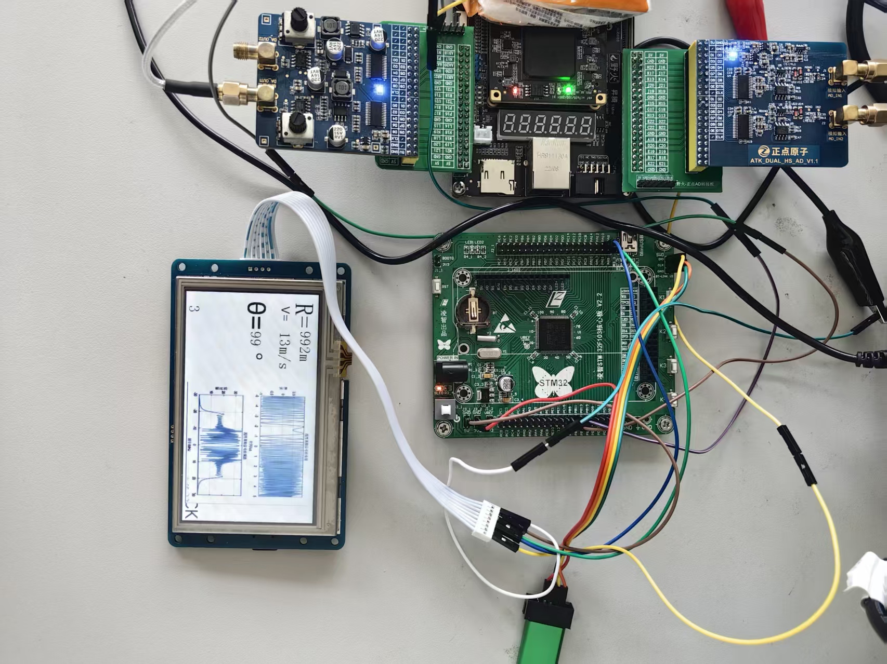
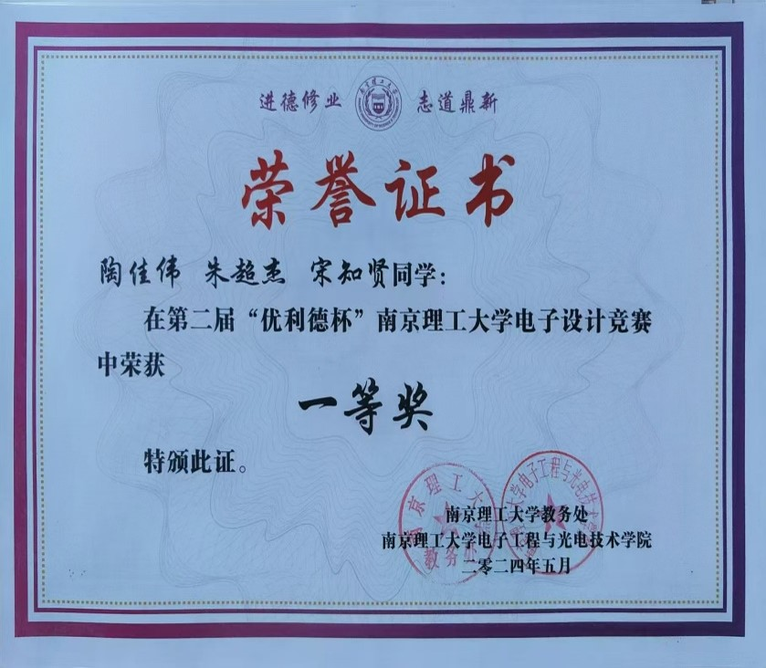

# radar

这是一个利用 Verilog 实现两路信号相位差测量的 FPGA 工程。

该工程来源于之前电子设计竞赛题目中的一部分，原题背景为利用干涉仪测向原理和线性调频连续波实现测距。项目重点是 FPGA 端对两路信号进行处理，并完成相位差测量。

## 工程内容

- Verilog 相位差测量逻辑
- FPGA 端信号处理相关模块
- 与干涉仪测向、线性调频连续波测距相关的工程资料
- 项目展示图片和相关获奖图片

## 项目图片

## 工程下载

完整工程已打包为 `radar.rar`，请在本仓库的 [Release 页面](https://github.com/taojiawei-sarem/radar/releases/tag/v1.0.0) 下载。

如果您觉得有用的话，请点一个 star。
